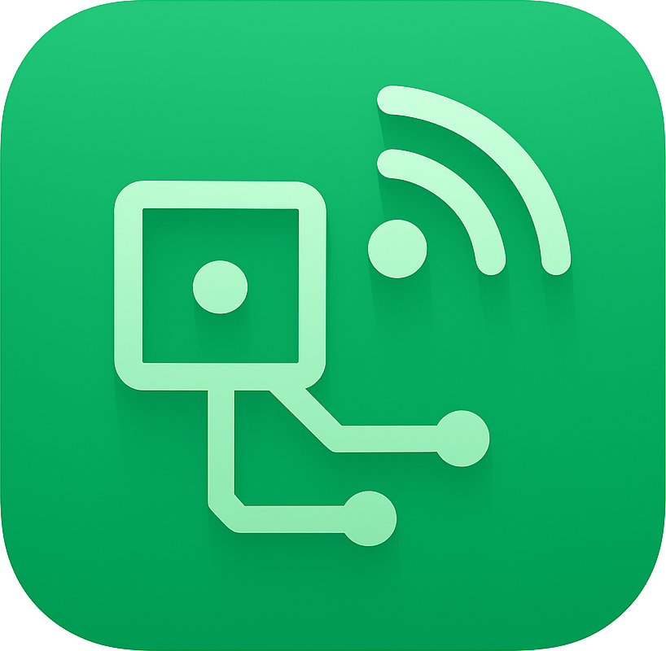

#  Open Sensor

Open Sensor is mainly written in order to provide an open-source and safe way to access sensor data of the device. It has a source-sink model where the data is collected from the source sensors and are sent to the chosen sinks.

The main objective is to collect sensor data such as accelerometer or gyroscope and publish it to Home Assistant through MQTT.

## Usage

In order to download _Open Sensor_ from Google Play, you have to join to the closed testing.

To get access to the app:

- Join the [Open Development](https://groups.google.com/g/open-development) group on Google Groups,
- and you will be able to see [Open Sensor](https://play.google.com/store/apps/details?id=com.opendevelopment.opensensor) on Google Play.

## Sources

Currently the following sensors are supported as data sources:

- Accelerometer
- Gyroscope
- Light
- Ambient Temperature
- Gravity

## Sinks

The only supported sink as of now is an MQTT broker.
